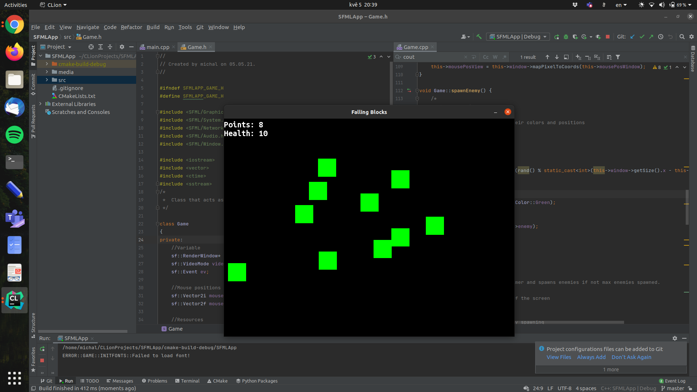

# SimpleSFMLGame

It's a simple mouse aim code-along game that I made as a part of learning C++ and SFML. The tutorial I followed is Suraj Sharma's Simple SFML [playlist](https://youtube.com/playlist?list=PL6xSOsbVA1eb_QqMTTcql_3PdOiE928up)

